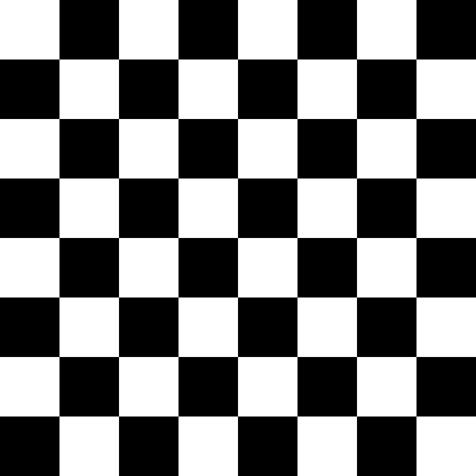
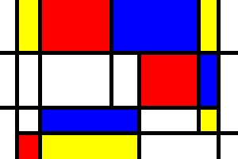
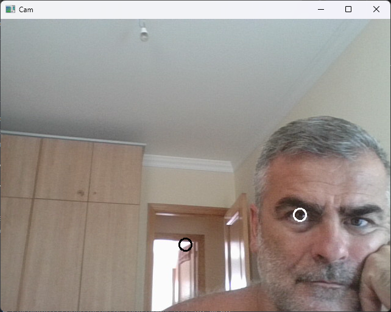
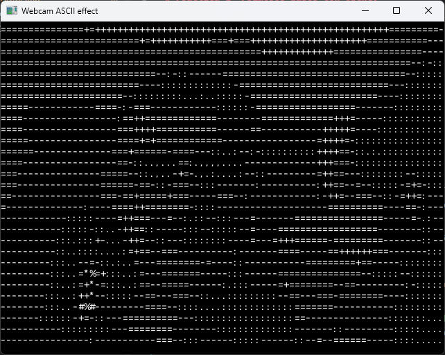
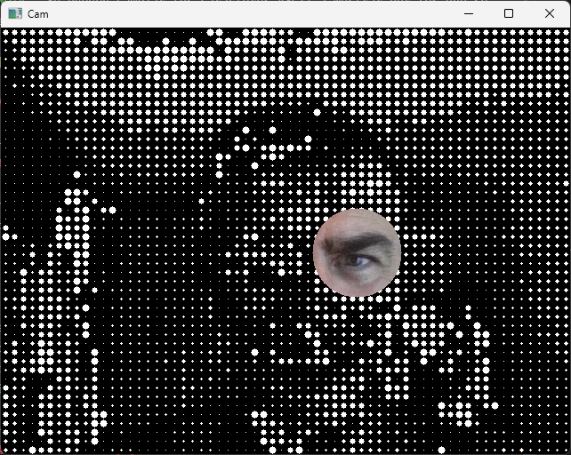
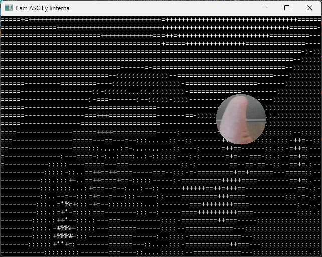

# Práctica 1: Primeros pasos con OpenCV
---
## Práctica de la asignatura **Visión por Computador** centrada en la introducción a la librería **OpenCV**, manipulación de imágenes y gestión y manipulación de vídeo en tiempo real.
---
## Autores

Este trabajo ha sido realizado por el **`Grupo 27`**: 
- `Alba Ramos Quintana`.
- `Néstor Jesús Henríquez Medina`.

## Descripción del Trabajo

En esta práctica se han abordado diferentes tareas para familiarizarse con el entorno de desarrollo y las funciones básicas de `OpenCV` en Python. 

El trabajo realizado así como el código fuente se encuentra en el cuaderno principal **[VC_P1.ipynb](VC_P1.ipynb)**.

## Objetivos

- Representar imágenes como matrices de NumPy.
- Dibujar figuras con OpenCV y visualizar resultados con Matplotlib.
- <u>[TAREA 1](#tarea-1-tablero-de-ajedrez)</u>: crear tablero de ajedrez (sin uso de IA y con IA).
- <u>[TAREA 2](#tarea-2-composición-de-estilo-mondrian)</u>: crear imagen estilo "Mondrian" con funciones OpenCV.
- <u>[TAREA 3](#tarea-3-píxeles-más-claro-y-más-oscuro)</u>: localizar los píxeles de menor y mayor intensidad en una imagen de vídeo en tiempo real.
- <u>[TAREA 4](#tarea-4-efecto-pop-art-mediante-ascii)</u>: crear efecto pop art propio: mostrar imagen de vídeo en tiempo real mediante caracteres ASCII.
- <u>[TAREA EXTRA 1](#tarea-extra-1-linterna-sobre-un-filtro-de-puntos)</u>: Efecto linterna. Implementación interactiva que sigue la posición del puntero del ratón, revelando dentro de un área circular la imagen original.
- <u>[TAREA EXTRA 2](#tarea-extra-2-pop-art-ascii--efecto-linterna)</u>: Combinación del efecto pop art (imagen en ASCII) con el efecto Linterna.

## Archivos de la práctica

| Archivo | Contenido |
| --- | --- |
| [README.md](README.md) | Este fichero que estás leyendo. |
| [VC_P1.ipynb](VC_P1.ipynb) | Código y explicaciones de las tareas. |
| [spec-list.txt](spec-list.txt) | Fichero de especificación del entorno `Conda` para Windows de 64 bits. |

## Preparación y ejecución

- Se necesita un intérprete de Python, así como las librerías `NumPy`, `OpenCV`, `Matplotlib` y un entorno que permita ejecutar cuadernos Jupyter (en nuestro caso, VS Code).
- Para las tareas de vídeo también es necesario disponer de una webcam.

Una posible opción de instalación es:

```bash
python -m pip install numpy opencv-python matplotlib notebook
python -m notebook VC_P1.ipynb
```

Como alternativa, el repositorio incluye una especificación de Conda para recrear el entorno listado, siempre que sus paquetes sigan disponibles:

```bash
conda create --name vc-p1 --file spec-list.txt
conda activate vc-p1
```

1. Abre el cuaderno desde la carpeta del repositorio y selecciona el entorno de Python correspondiente.
2. Ejecuta las importaciones y las celdas en orden. La tarea de Mondrian utiliza inicialmente las variables `alto` y `ancho` definidas en la segunda solución del tablero.
3. En cada tarea de webcam, pulsa **Esc con la ventana de OpenCV activa** para salir del bucle antes de ejecutar la siguiente.
4. En las tareas extra con efecto linterna, mueve el ratón sobre la ventana para desplazar la zona circular.

`NOTA`: Las capturas utilizan `cv2.VideoCapture(0)`, que selecciona la cámara con índice 0. Si tu cámara tiene otro índice, adapta ese valor. Las celdas de dibujo guardan sus imágenes en el directorio de trabajo y pueden sobrescribir los dos ejemplos existentes.

---
## Tarea 1: Tablero de ajedrez

Se construye un tablero de **800 × 800 píxeles**, dividido en **8 × 8 casillas de 100 × 100 píxeles**. Para alternar los colores se comprueba la paridad de la suma de la fila y la columna:

```python
(fila + columna) % 2 == 0
```

Se muestran dos posibles soluciones:

1. **Sin IA:** Se utiliza menos cantidad de líneas de código, puesto que se crea una matriz de 1 canal (escala de grises) y las casillas claras se pintan de blanco (reciben el valor `1`) y las oscuras no se dibujan, con el consecuente ahorro de cómputo.

2. **Con IA:** Crea una imagen de 3 canales y dibuja todas las casillas con `cv2.rectangle`, utilizando valores `0` y `255`. Aunque es algo menos óptimo en rendimiento bruto, resulta en un código altamente legible. También guarda el resultado con `cv2.imwrite`.



*Resultado: ejemplo guardado por la solución con OpenCV.*

## Tarea 2: Composición de estilo Mondrian

Sobre un fondo blanco se dibujan rectángulos de colores primarios y líneas negras, formando una composición geométrica inspirada en Mondrian.

| Función | Uso en la tarea |
| --- | --- |
| `np.zeros` | Crea la matriz de la imagen. |
| `cv2.rectangle(..., -1)` | Dibuja rectángulos rellenos. |
| `cv2.line` | Añade las separaciones negras. |
| `cv2.cvtColor(..., cv2.COLOR_BGR2RGB)` | Prepara los colores para Matplotlib. |
| `cv2.imwrite` | Guarda la composición en JPEG. |



*Resultado: ejemplo guardado del dibujo estilo "Mondrian" de tamaño 300 × 200 píxels.*

---
## Tarea 3: Píxeles más claro y más oscuro

Cada fotograma de la webcam se convierte a escala de grises. Después, `cv2.minMaxLoc` localiza los píxels con la intensidad mínima y máxima y sus coordenadas; posteriormente, se marcan esos píxels sobre la imagen con un círculo.

El orden de sus resultados es:

```python
min_val, max_val, min_loc, max_loc = cv2.minMaxLoc(frame_gray)
```

Sobre el fotograma en color se dibujan dos marcas de radio 10 y grosor 2:

| Posición detectada | Marca | Motivo |
| --- | --- | --- |
| Píxel más oscuro | Círculo blanco | Contrasta con la zona oscura. |
| Píxel más claro | Círculo negro | Contrasta con la zona clara. |

Por ejemplo, si la cámara apunta a una hoja blanca sobre una mesa oscura, las marcas señalarán los extremos de brillo encontrados en esa escena. Se buscan píxeles individuales, por lo que las posiciones pueden cambiar entre fotogramas.


*Resultado: captura de imagen mostrando píxel más claro y píxel más oscuro.*

---
## Tarea 4: Efecto Pop Art mediante ASCII

La imagen de la webcam se representa mediante caracteres ASCII blancos sobre fondo negro. El proceso de cada fotograma es el siguiente:

1. Aplicamos un reflejo horizontal con `cv2.flip` para obtener un efecto espejo.
2. Convertimos la imagen a escala de grises.
3. Dividimos la imagen en bloques de **8 × 16 píxeles**, pues suele ser el tamaño típico de una fuente ASCII básica.
4. Calculamos el brillo medio de cada bloque con `np.mean`.
5. EL nivel de brillo lo convertimos en un índice de la lista de caracteres ASCII.
6. Dibujamos el carácter con `cv2.putText`.

Conversión del brillo en el índice de la lista de caracteres ASCII:
```python
char_index = int(brightness * (len(char_ascii) - 1) / 255)
```

La lista original se invierte, de manera que las regiones oscuras se representan con espacios o signos poco densos y las claras con caracteres como `#`, `%` y `@`:

```text
 Oscuro                             Claro
[espacio]  ,  .  :  -  =  +  *  #  %  @
```

`NOTA`: Se pueden cambiar los caracteres ASCII a mostrar por los que se desee.



*Resultado: captura de imagen de vídeo en caracteres ASCII.*

---
## TAREA EXTRA 1: Linterna sobre un filtro de puntos

Una máscara circular de **radio 50 píxeles**, centrada en el puntero, combina dos versiones de la escena:

- **Dentro del círculo:** imagen original en color.
- **Fuera del círculo:** representación mediante círculos.

La máscara selecciona el interior y su inversa selecciona el exterior. Se aplica `cv2.bitwise_and` a cada imagen y se suman ambas partes con `cv2.add`. Por tanto, la linterna revela el vídeo original sobre el fondo filtrado.


*Resultado: captura de imagen de vídeo con efecto linterna aplicado.*

---
## TAREA EXTRA 2: pop art ASCII + efecto linterna

Combinamos el procedimiento de la tarea 4 con la misma máscara circular interactiva: el exterior conserva los caracteres ASCII y el interior muestra la captura original en color, con efecto espejo.

Esta versión obtiene la resolución desde `frame.shape` y coloca el texto en `(x1, y1 + 12)`, desplazando su línea base para que la primera fila de caracteres sea visible.


*Resultado: captura de imagen de vídeo con efecto ASCII+linterna aplicado.*


---