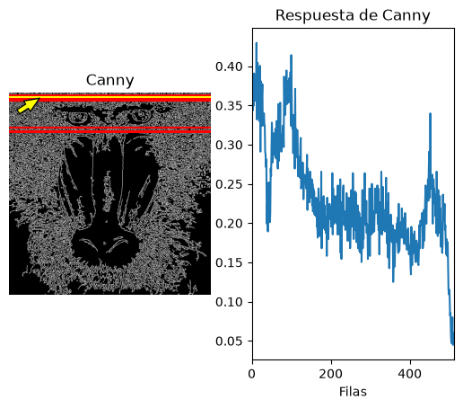
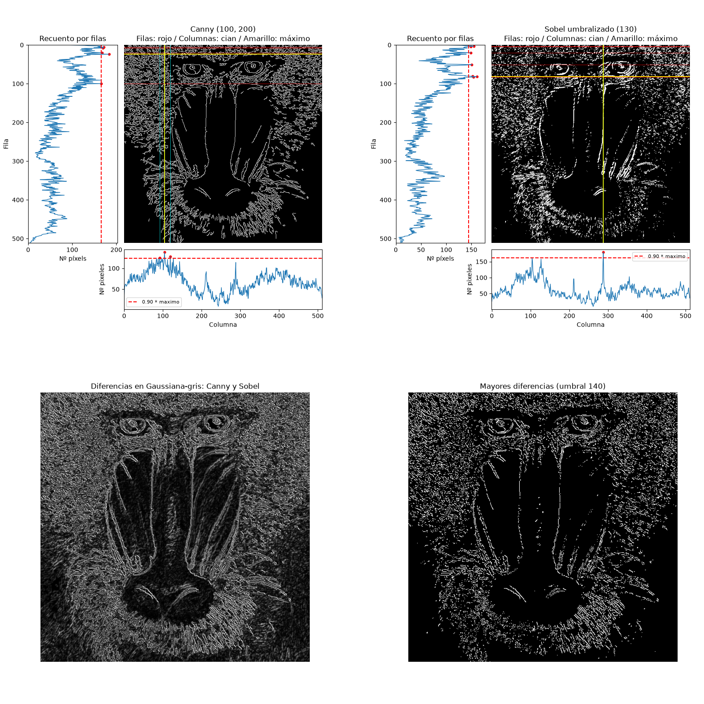

# Práctica 2 — Funciones básicas de OpenCV

Práctica de la asignatura **Visión por Computador** dedicada al procesamiento básico de imágenes y vídeo con OpenCV. El trabajo incluye detección de bordes, recuento de píxeles, umbralización, comparación de detectores y dos demostradores interactivos con webcam.

El desarrollo completo se encuentra en el siguiente enlace a GitHub: 

 ### [Visión por Computador - Práctica 2](https://github.com/albaquiintanaa/VC_PRACTICAS/tree/P2)

## Autores
- [Alba Quintana Ramos](https://github.com/albaquiintanaa)
- [Néstor Jesús Henríquez Medina](https://github.com/NestorJHM)

## Contenidos

1. [Requisitos y ejecución](#requisitos-y-ejecución)
2. [Tarea 1 — Recuento de píxeles por filas](#tarea-1--recuento-de-píxeles-por-filas)
3. [Tarea 2 — Comparación entre Canny y Sobel](#tarea-2--comparación-entre-canny-y-sobel)
4. [Tarea 3 — Pelota interactiva](#demostrador-adicional--pelota-interactiva)
5. [Referencias](#referencias)

### Dependencias
- OpenCV
- NumPy
- Matplotlib

Las dependencias pueden instalarse con:

```bash
pip install opencv-python numpy matplotlib
```

### Ejecución

1. Clonar o descargar este repositorio.
2. Abrir `VC_P2.ipynb` con Jupyter Notebook o VS Code.
3. Cada celda es independiente en su ejecución.
4. Para los demostradores interactivos, permitir el acceso a la webcam.
---
# Tareas a realizar
---

## Tarea 1 — Recuento de píxeles por filas

### Objetivo

Partiendo de la imagen binaria generada por el detector de bordes Canny, se calcula el número de píxeles blancos de cada fila. Después se determina:

- La fila que contiene el máximo número de píxeles blancos.
- El valor máximo obtenido.
- Las filas cuyo recuento supera el 90 % del máximo.
- La posición de todas las filas seleccionadas.

### Procedimiento

La suma por filas se realiza con `cv2.reduce`. Como la salida de Canny contiene valores `0` y `255`, el resultado se divide entre `255` y entre el número de columnas para obtener una proporción de píxeles blancos.

La fila máxima se obtiene con `np.argmax`. Sobre la imagen de Canny se dibujan:

- En amarillo, la fila con el máximo recuento.
- En rojo, las demás filas que superan el 90 % del máximo.
- Una flecha para destacar visualmente la fila con el máximo recuento.

También se representa una gráfica con el recuento obtenido para todas las filas.

### Resultado de la Tarea 1

Este procedimiento permite identificar las alturas de la imagen en las que existe una mayor concentración de bordes horizontales o de cambios relevantes en la escena.




---
## Tarea 2 — Comparación entre Canny y Sobel

### Objetivo

Aplicar un umbral a la imagen obtenida mediante Sobel y comparar sus resultados con los producidos por Canny. Para ambos métodos se calcula:

- El número de píxeles no nulos por fila y por columna.
- El máximo por filas y el máximo por columnas.
- Las filas y columnas que superan el 90 % de su máximo correspondiente.
- El número total y el porcentaje de píxeles no nulos.

### Procedimiento

La imagen `mandril.jpg` se convierte a escala de grises y se suaviza mediante un filtro gaussiano. A continuación:

1. Se calculan las derivadas horizontal y vertical con Sobel.
2. El resultado se convierte a 8 bits.
3. Se aplica un umbral de valor `130`.
4. Se obtiene Canny utilizando los umbrales `100` y `200`.
5. Se cuentan los píxeles no nulos mediante `np.count_nonzero`.
6. Se remarcan las filas y columnas seleccionadas sobre las imágenes.

Código de colores utilizado:

- Rojo: filas que superan el 90 % del máximo.
- Cian: columnas que superan el 90 % del máximo.
- Amarillo: fila y columna con el máximo absoluto.

### Resultados obtenidos

| Método | Máximo por fila | Máximo por columna | Filas seleccionadas | Columnas seleccionadas | Píxeles no nulos |
|---|---:|---:|---:|---:|---:|
| Canny | 220 | 187 | 5 | 3 | 55 509 (21,18 %) |
| Sobel umbralizado | 161 | 179 | 7 | 1 | 31 199 (11,90 %) |

El detector Canny produce contornos generalmente más finos y continuos y conserva más detalle del pelo del mandril.

Por contra, Sobel umbralizado genera trazos más gruesos y fragmentados, y el resultado depende de manera más directa del umbral seleccionado.

También se muestra la diferencia absoluta entre las dos salidas y una versión umbralizada de esa diferencia para localizar las discrepancias más significativas.

### Resultado de la Tarea 2



---
## TAREA 3 — Pelota interactiva

### Objetivo

Superponer una pelota virtual sobre la imagen de la webcam y simular su movimiento mediante gravedad, velocidad y rebotes. El usuario puede golpearla hacia arriba moviendo la mano cerca de ella.

### Detección del golpe

La región que rodea la posición actual de la pelota se extrae en dos fotogramas consecutivos. Para cada región:

1. Se calcula un histograma de niveles de gris con `cv2.calcHist`.
2. El histograma se normaliza mediante la norma L1.
3. Ambos histogramas se comparan utilizando la distancia de Bhattacharyya.
4. Si la variación supera `UMBRAL_GOLPE`, se aplica un impulso vertical ascendente.

La comparación utiliza las mismas coordenadas en ambos fotogramas. Por ello, los bordes y colores estáticos del fondo no provocan golpes por sí solos; es necesario que exista una variación temporal cerca de la pelota.

Para evitar que un único movimiento se interprete como varios impactos, se establece un intervalo mínimo de `0,20` segundos entre golpes.

### Física de la pelota

La simulación utiliza el tiempo real transcurrido entre fotogramas. En cada iteración:

```python
velocidad[1] += GRAVEDAD * dt
posicion += velocidad * dt
```

La pelota rebota contra los cuatro límites de la imagen. El coeficiente de rebote reduce su velocidad después de cada colisión para representar una pérdida gradual de energía.

### Controles

| Tecla | Acción |
|---|---|
| `R` | Reinicia la posición y la velocidad de la pelota |
| `ESC` | Cierra el demostrador |

> **Espacio reservado para la evidencia del demostrador de la pelota**
> Añadir aquí una captura con la pelota, otra con la ventana de histogramas y un vídeo que muestre los golpes y rebotes.

<!--
Ejemplos para incorporar las capturas:


Ejemplo para incorporar el vídeo:

[Vídeo demostrativo de la pelota interactiva](URL_DEL_VIDEO)
-->

## Estructura del proyecto

```text
VC_PRACTICAS/
├── README.md
├── VC_P2.ipynb
└── mandril.jpg
```

Se recomienda guardar las evidencias futuras con una estructura similar a:

```text
docs/
├── imagenes/
│   ├── tarea1-canny-filas.png
│   ├── tarea2-canny-sobel.png
│   ├── tarea3-espejo-empanado.png
│   ├── tarea3-espejo-limpio.png
│   ├── pelota-webcam.png
│   └── pelota-histogramas.png
└── videos/
```

## Referencias

- [OpenCV](https://opencv.org/)
- [Documentación de OpenCV](https://docs.opencv.org/)
- [My Little Piece of Privacy — Niklas Roy](https://www.niklasroy.com/project/88/my-little-piece-of-privacy)
- [Messa di Voce — Golan Levin y Zachary Lieberman](https://youtu.be/GfoqiyB1ndE?feature=shared)
- [Virtual Air Guitar](https://youtu.be/FIAmyoEpV5c?feature=shared)
